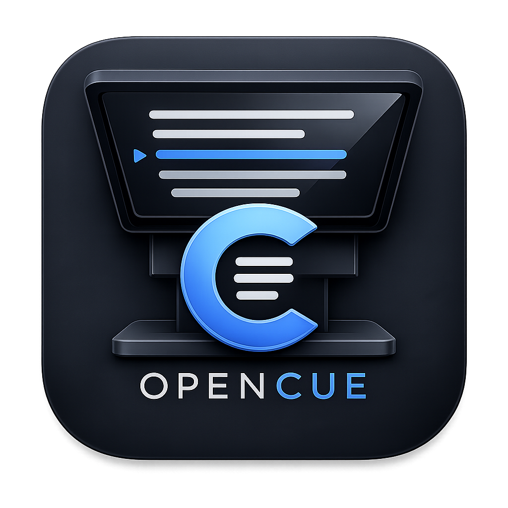

  
  <h1>OpenCue</h1>

**OpenCue** is a clean, reliable, and privacy-first native macOS teleprompter designed for creators, presenters, podcasters, and streamers. 

Built entirely with Swift, SwiftUI, and AppKit, OpenCue focuses on solving the biggest pain point for remote presenters and solo creators: providing a great teleprompter that seamlessly fits into workflows with Zoom, OBS, and hardware like the Elgato Prompter without getting in the way.

No cloud syncing, no accounts, and no data mining. Everything stays on your Mac.

---

## 🚀 Features (1.0.0 MVP)

* **Script Editor & Library**: Create, edit, and organize multiple scripts. Import and export `.txt` and `.md` files directly.
* **Rock-Solid Playback**: Silky smooth scrolling on both Apple Silicon and Intel Macs with live speed adjustments via keyboard.
* **Floating Overlay Mode**: Keep the prompter *always-on-top* with adjustable transparency. Perfect for reading your script while looking directly at your webcam during video calls or recordings.
* **External Display & Mirroring**: Send the prompter output to a secondary display (like an Elgato Prompter) and independently mirror text horizontally or vertically for use with prompter glass.
* **Local-First Privacy**: Scripts are automatically saved locally. No network required, ever.

---

## 🗺️ Roadmap (Post-1.0.0)

We have an exciting roadmap planned to build upon the 1.0.0 foundation:

* **1.1.0 (Production Polish):** Cue points (add, rename, jump), Page mode, Timed scroll, RTF support, and shortcut customization.
* **1.2.0 (Creator Workflow):** Outline mode for talking points, hidden segment notes, sponsor read blocks, and script tagging.
* **1.3.0 (Voice Assist):** Silence detection (auto-pause when you stop speaking) and basic speech recognition experiments.
* **1.4.0 (Hardware Control):** Stream Deck integration, game controller support, and presenter clicker profiles.
* **1.5.0 (Remote Control):** Local web remote to control the prompter from your phone's browser via QR code pairing.
* **1.6.0 (Captions & Exports):** Automatic SRT subtitle generation based on timing estimates.
* **2.0.0 (Voice Follow):** Full voice following that scrolls intelligently as you speak and pauses when you ad-lib.
* **2.1.0 (Multilingual & Accessibility):** UI localization, dyslexia-friendly fonts, high contrast themes, reduced motion mode, and VoiceOver improvements.
* **2.2.0 (Recording):** Camera preview, local video recording, take management, and video export.
* **2.3.0 (Studio):** Multi-output with different settings, operator console vs. talent view, rundown mode, and a local network control API.
* **3.0.0 (Companion Ecosystem):** Native iPhone remote app, iPad prompter mode, Apple Watch control, and optional script sync.

---

## 🤝 Contributing

We welcome contributions! Whether you're fixing bugs, adding new features, or improving documentation, your help is appreciated.

### Getting Started
1. **Requirements:** You will need a Mac running macOS 13.0+ and Xcode 15+ (Swift 5.9+).
2. **Clone & Open:** Clone the repository and open `OpenCue.xcodeproj` in Xcode. The project does not currently rely on complex external package managers for core functionality.
3. **Architecture Overview:** OpenCue is highly modularized into distinct communities:
   * `Core/Models`: Core data structures (`ScriptDocument`, etc.)
   * `Core/Persistence`: Local-first storage (`CueStorage`)
   * `Core/Playback`: Scroll logic, timing, and state (`PlaybackEngine`)
   * `Features/*`: Specific UI components (`Prompter`, `Editor`, `Library`, `Settings`)
   * `Platform/Windows` & `Displays`: AppKit-heavy modules for floating overlays and multi-display management.

### Guidelines
* **Readability Beats Features:** When proposing UI changes, prioritize text readability and a distraction-free prompting experience over complex toolbars.
* **Keep it Local:** Features that require cloud services or send data off-device will not be accepted.
* **Write Tests:** We maintain a robust test suite in `OpenCueTests` (covering playback logic, document mutating, window management, etc.). Please ensure your PR includes tests for new core logic.
* **Create an Issue:** For significant new features (especially those on the post-1.0 roadmap), please open an issue first to discuss the implementation approach.

### Submitting a Pull Request
1. Fork the repository and create your feature branch (`git checkout -b feature/my-new-feature`).
2. Commit your changes (`git commit -am 'Add some feature'`).
3. Ensure all tests pass.
4. Push to the branch (`git push origin feature/my-new-feature`).
5. Open a Pull Request.

---
*OpenCue - Read confidently.*
